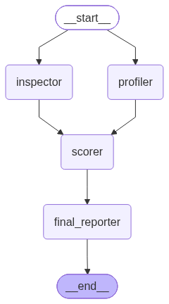

# **code-analyzer**
- **code-analyzer** is an AI-powered code analysis tool driven by **LangGraph workflows**. The purpose of the **code-analyzer** tool is not to modify or edit user code, but to inspect the user's code, find errors, make suggestions, and present them to the user; applying these modifications is entirely up to the user.

**Graph Photo:**



## Features
- ***Detects code deficiencies, errors, and lint warnings.***
- ***Provides corrected, ready-to-use copy-paste solutions for errors.***
- ***Makes recommendations for the code, determines the code's intent, and scores the code across specific metrics.***
- ***Gives exact line ranges for errors and recommendations, and prioritizes them.***
- ***Classifies fix difficulty and fix importance for errors and recommendations.***

## Workflow Structure

### How It Works

Four worker two running in parallel operate to analyze the code. When workers complete their tasks, they submit their reports to a **shared pool**. Reports are added to the pool at each step, and the next worker reads all existing reports in the pool to generate its own report.
This enables each worker to inherit context from previous reports, increasing analysis accuracy. First, the **profiler** and **inspector** workers begin running in parallel. While the **profiler** analyzes the code structure, the **inspector** detects errors in the code and generates recommendations. Next, the **scorer** inspects the code and generated reports, rates the code across specified attributes, and explains the rationale behind the scores. Re-inspecting the accumulated reports in the pool and the original code, the **final reporter** creates the final report in **markdown** format.

#### **Workers:**

* **parallel workers:**
    * **profiler** and **inspector** start running in parallel; while errors are analyzed on one side, code structure is resolved on the other.

        * **profiler:** analyzes code, extracts a summary regarding what the code aims to do, and lists strengths and weaknesses of the code.
        * **inspector:** acts as the inspector for code; finds errors in code, prioritizes them, and makes recommendations about the code.

* **sequential workers:**
    * **scorer** takes the report generated from the previous parallel execution and scores the code; then all reports are delivered to the **final reporter** worker for the final output.

        * **scorer:** scores code across specific attributes and explains the reasoning behind the scores.
        * **final reporter:** receives all analysis results and creates the final report in markdown format.

## How to Download?

- **Clone this repository:**

```bash

git clone https://github.com/shbgg/code-analyzer.git

```

- **Navigate to the project root directory:**

```bash

cd code-analyzer

```

- **Create the Conda environment:**

```bash

conda env create -f environment.yaml

```

- **Activate the Conda environment:**

```bash

conda activate code-analyzer

```

- **İnstall the analyzer with pip:**

```bash

pip install .

```

## How to Use?
**code-analyzer can be used both within Python and as a CLI tool.**

### Usage via CLI

- **Activate the Conda environment:**

```bash

conda activate code-analyzer

```

- **Save your global API key:**

```bash

code-analyzer config --set-key your_api_key

```
- **Start analysis with a file:**

```bash

code-analyzer run --path your_path

```
- **Start analysis with code:**

```bash

code-analyzer run --code "print('hello world')"

```

- A specific model can be used with the **--model** option. Code analyzer uses the **gemini-2.5-flash-lite** model by default.


```bash

code-analyzer run --code "print('hello world')" --model gemini-2.5-flash

```

- Analysis can be initiated with a different API key instead of the permanent key using the **--api-key** option.


```bash

code-analyzer run --code "print('hello world')" --api-key your_api_key

```

### Usage inside Python

**For detailed Python usage, check out the usage.ipynb file under the test folder.**

**First, select your code-analyzer kernel in your IDE.**

- **Import and instantiate the analyzer class:**

```python
from code_analyzer import CodeAnalyzer

model_name = "gemini-2.5-flash-lite" # Any Google Gen AI model can be used.

analyzer = CodeAnalyzer(model_name)

```

- **Start analysis with code:**

```python
code = "print('Hello world')"

# synchronous analysis
result = analyzer.analyze(code)
print(result)

# asynchronous analysis
result = await analyzer.async_analyze(code)
print(result)

```

- **Start analysis with a file:**

```python
code = "print('Hello world')"

result = analyzer.analyze_from_file(code)
print(result)

```

- **Using callback function:**

When starting an analysis with the Analyzer class, you can pass the callback parameter to have reports delivered to your custom callback function.
This allows you to easily bind the analyzer class to your own interfaces. If you pass a callback parameter to the function when starting an analysis via file or code, the function returns nothing; if no callback function is provided, it returns the graph state as a dictionary.

Two different dataclass types can be passed to your callback function:

* **NodeFlag:** emits a NodeFlag object to the callback when a worker starts or finishes execution. This object contains two attributes:
    * **flag:** if the flag attribute is True, it means the worker has started; if False, the worker has completed.
    * **worker_name:** this attribute is the name of the worker emitting the NodeFlag object.
    
* **AnalysisReport:** 
    * **profiler_report:** report of the worker analyzing the code.
    * **scorer_report:** report of the worker scoring code across specific attributes.
    * **inspector_report:** report of the worker detecting errors in code and making recommendations.
    * **final_report:** report of the worker compiling all reports into a single markdown-formatted report.
    
- **A custom callback function can be defined as follows:**

```python
def CustomCallback(data: AnalysisReport | NodeFlag):
    if isinstance(data, NodeFlag):
        ...

    if isinstance(data, AnalysisReport):
        ...

```
